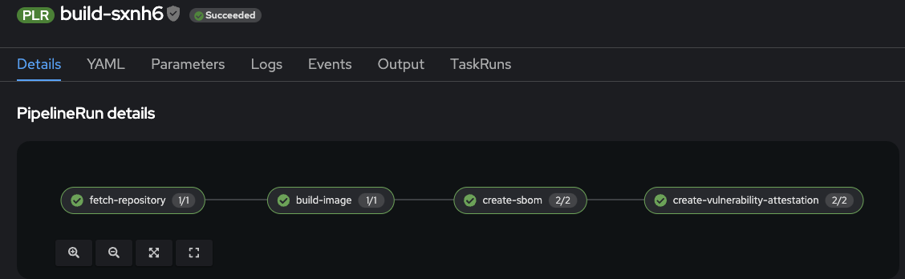
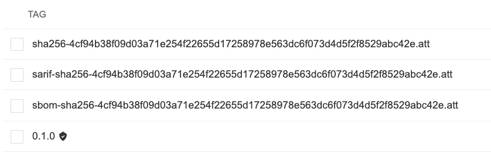

# Security Demo Instruction - Vault

## Prerequisites
- HashiCorp Vault is available
- OpenShift cluster is available
- openshift-gitops operator installed
- openshift-pipelines operator installed


## Configurations

### Vault

If you have your own vault instance running, please check `hashicorp-vault/config` 
to enable [Transit Secret Engine](https://developer.hashicorp.com/vault/docs/secrets/transit) for later use.

If you don't have vault instance at hand, you can deploy vault via [ArgoCD](https://github.com/StinkyBenji/secure-the-chain/tree/feat/vault/hashicorp-vault/vault-app.yaml), it uses a customized [helm charts](https://github.com/StinkyBenji/agnosticg/tree/main/charts/hashicorp-vault) for vault deployment.

### Tekton Chains

once Vault is configured, we need to configure tekton chains controller to use hashicorp vault as signer (check [the documentation](https://docs.openshift.com/pipelines/1.15/secure/using-tekton-chains-for-openshift-pipelines-supply-chain-security.html) for more supported configuration parameters).

In the [tekton config example](https://github.com/StinkyBenji/secure-the-chain/tree/feat/vault/tekton-chains-demo/vault/tektonconfig/tektonconfig.example.yaml), we specified hashivault://cosign as our kmskeyref. The Vault address and Vault token, which use the cosign policy, also need to be included in the configuration.

## Pipeline Demo time
The demo includes a simple image build pipeline where the image will be signed. Additionally, SBOM and vulnerability reports will be generated separately by Syft and Grype, respectively, and attached to the image.

### Set up Authentication

`pipeline` service account will need the registry credentials to push image and its signatures and attestations to the desired OCI registry.
Therefore, we need to create a secret that contains the required dockerconfig.json and link it to the service account that will be used in the pipeline. 

### Task and Pipeline
As mentioned, we use syft for generating SBOM and grype for scanning vulnerabilities. Two custom Tekton Tasks are needed (see `tekton-chains-demo/vault/tasks`). Additionally, a cosign script is added to both tasks, which will use `hashivault://cosign` to attest both generated SBOM and vulnerability report to the built image

```
cosign attest -y --tlog-upload=false --key=$(params.vault-key) --predicate /attestation_tmp/attestation.sarif --type vuln $(params.IMAGE)@$(tasks.build-image.results.IMAGE_DIGEST) --attachment-tag-prefix sarif- 
```

Therefore, we need to create a secret that contains `VAULT_ADDR` AND `VAULT_TOKEN` for the task to use.

Once everything is setup, we can create the pipelinerun 



Quay is used for the image registry

 

From the picture, we can see that the image is signed and the corresponding SBOM and vulnerability report are attached to it as well.

### Verification

We can verify the attestation by running `cosign verify-attestation --insecure-ignore-tlog=true --type slsaprovenance --key hashivault://cosign <IMAGE>:<TAG>`

Alternatively, we can use `cosign tree <IMAGE>:<TAG>`, it will display supply chain security related artifacts for an image such as signatures, SBOMs and attestations.


## More to read
- [Transit secret engine](https://developer.hashicorp.com/vault/tutorials/encryption-as-a-service/eaas-transit)
- [transit signing](https://gist.github.com/stenio123/0ae467df32364efad0ca01d3b9c3e1c5)
- https://tekton.dev/docs/chains/hashicorp-integration-tutorial/
